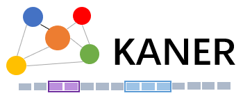

# Introduction
**KANER** (*Knowledge-Aware Named Entity Recognition*) is a toolkit with various knowledge-enhanced NER models aiming to facilitate development, expriment and test of these models. It provides a library of machine learning modules and the pipeline for training models.

# Getting Started
## Setup Environment
**KANER requires Python 3.6.0 or above.**

```bash
virtualenv ./env
source ./env/bin/activate
pip install -r requirements.txt
```

## API references
### Datasets
KANER currently implements the interfaces of the following datasets:

- [WeiboNER](https://github.com/hltcoe/golden-horse) (**uid: weiboner**) released with the paper [Named Entity Recognition for Chinese Social Media with Jointly Trained Embeddings](https://www.aclweb.org/anthology/D15-1064/) by Nanyun Peng, Mark Dredze.
- [ResumeNER](https://github.com/jiesutd/LatticeLSTM/tree/master/ResumeNER) (**uid: resumener**) released with the paper [Chinese NER Using Lattice LSTM](https://www.aclweb.org/anthology/P18-1144/) by Yue Zhang, Jie Yang.
- [MSRANER](https://www.microsoft.com/en-us/download/details.aspx?id=52531) (**uid: msraner**) released with the paper [Chinese Word Segmentation and Named Entity Recognition: A Pragmatic Approach](https://www.aclweb.org/anthology/J05-4005/) by Jianfeng Gao, Mu Li, Andi Wu, Chang-Ning Huang.
- [OntoNotes](https://catalog.ldc.upenn.edu/LDC2011T03) (**uid: ontonotes**) released with the paper [OntoNotes Release 5.0](https://catalog.ldc.upenn.edu/docs/LDC2013T19/OntoNotes-Release-5.0.pdf) by Ralph Weischedel, Martha Palmer, Mitchell Marcus, Eduard Hovy, Sameer Pradhan, Lance Ramshaw, Nianwen Xue, Ann Taylor, Jeff Kaufman, Michelle Franchini, Mohammed El-Bachouti, Robert Belvin, Ann Houston.
- [ECommerce](https://github.com/PhantomGrapes/MultiDigraphNER/tree/master/data/ecommerce) (**uid: ecommerce**) released with the paper [A Neural Multi-digraph Model for Chinese NER with Gazetteers](https://www.aclweb.org/anthology/P19-1141/) by Ruixue Ding, Pengjun Xie, Xiaoyan Zhang, Wei Lu, Linlin Li, Luo Si.
- [CHIP](https://www.biendata.xyz/competition/chip_2020_1/) (**uid: chip**) released with the competition [CHIP 2020 - Chinese Medical Entity Recognition](https://www.biendata.xyz/competition/chip_2020_1/) by Peking University, Zhengzhou University, Harbin Institute of Technology, Shenzhen, Peng Cheng Laboratory.

KANER also made some attempts on event extraction by considering event extraction as named entity recognition. The following two datasets come from event extraction competitions. 
- [CCKSEE](https://www.biendata.xyz/competition/ccks_2020_4_2/data/) (**uid: ccksee**) released with the competition [CCKS 2020: Event Element Extaction](https://www.biendata.xyz/competition/ccks_2020_4_2/data/) by CCKS, ANT Group, Institute of Automation，Chinese Academy of Sciences.

### Knowledeg Bases
KANER currently implements the interfaces of the following knowledge bases:
- [Gigaword](https://github.com/jiesutd/LatticeLSTM) (**uid: gigaword**) released with the repository [https://github.com/jiesutd/LatticeLSTM](https://github.com/jiesutd/LatticeLSTM).
- [SGNS](https://github.com/Embedding/Chinese-Word-Vectors) (**uid: sgns**) released with the repository [https://github.com/Embedding/Chinese-Word-Vectors](https://github.com/Embedding/Chinese-Word-Vectors).
- [TEC](https://github.com/PhantomGrapes/MultiDigraphNER/tree/master/data/dics) (**uid: tec**) released with the repository [https://github.com/PhantomGrapes/MultiDigraphNER](https://github.com/PhantomGrapes/MultiDigraphNER/tree/master/data/dics).
- [ICD](http://code.nhsa.gov.cn:8000/) (**uid: icd**) released with the website [http://code.nhsa.gov.cn:8000/](http://code.nhsa.gov.cn:8000/).

### Models
KANER currently provides the following NER models:
- [BLCRF](#) (**uid: blcrf**) released with the paper [Bidirectional LSTM-CRF for Named Entity Recognition](https://www.aclweb.org/anthology/Y18-1061/) by Panchendrarajan, Rrubaa and Amaresan, Aravindh.
- [PLMTG](#) (**uid: plmtg**) released with the paper [BERT: Pre-training of Deep Bidirectional Transformers for Language Understanding](https://www.aclweb.org/anthology/N19-1423/) by Jacob Devlin, Ming-Wei Chang, Kenton Lee, Kristina Toutanova.
- [SES](#) (**uid: ses**) released with the paper [Simplify the Usage of Lexicon in Chinese NER](https://www.aclweb.org/anthology/2020.acl-main.528/) by Ruotian Ma, Minlong Peng, Qi Zhang, Zhongyu Wei, Xuanjing Huang.
- [CGN](#) (**uid: cgn**) released with the paper [Leverage Lexical Knowledge for Chinese Named Entity Recognition via Collaborative Graph Network](https://www.aclweb.org/anthology/D19-1396/) by Dianbo Sui, Yubo Chen, Kang Liu, Jun Zhao, Shengping Liu.
- [MDGG](#) (**uid: mdgg**) released with the paper [A Neural Multi-digraph Model for Chinese NER with Gazetteers](https://www.aclweb.org/anthology/P19-1141/) by Ruixue Ding, Pengjun Xie, Xiaoyan Zhang, Wei Lu, Linlin Li, Luo Si.

### Quick tour
Let's do a very quick tour of KANER. If you want to train a model, you just need to type the following command:

```bash
python app.py train --cfgpath "./configs/blcrf.yml"
```

If you haved trained a model on the dataset and want to do some case study for checking the model's performance, then you can use our service module that provides an online REST API to debug your model. More details can be found in the tutorial [service](./docs/tutorials/service.md).

Additionaly, we provide a series of notebooks in [notebooks/](notebooks/) that includes various experiments and data analysis.


# Build and Test
## Test
We use [PyTest](https://docs.pytest.org/en/stable/) to help us to test this project. You just need to run the following command for testing this project:

```bash
pytest ./tests/
```

## Build
The following command help you to build a package. The detailed tutorial can be found in [Packaging Projects](https://packaging.python.org/tutorials/packaging-projects/).

```bash
python setup.py sdist bdist_wheel
```
